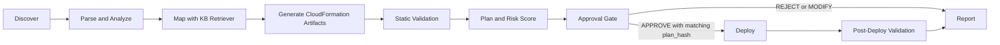

# Architecture

## End-to-End Flow

The system is built as a LangGraph pipeline with typed shared state. Each node consumes MigrationState, produces an updated state snapshot, and appends an audit record.

## Runtime Components

- Graph builder: src/graph/build_graph.py
- Shared state contracts: src/graph/state.py
- Stage nodes:
  - discovery: src/agents/discovery/node.py
  - parser/analyzer: src/agents/parser/node.py
  - mapping: src/agents/mapping/node.py
  - generator: src/agents/generator/node.py
  - validator: src/agents/validator/node.py
  - planner: src/agents/planner/node.py
  - approval: src/agents/approval/node.py
  - deployer: src/agents/deployer/node.py
  - postvalidate: src/agents/postvalidate/node.py
  - reporter: src/agents/reporter/node.py

## State and Audit Model

MigrationState carries the full workflow context, including:
- discovered and parsed resources
- mapping results with rule_id
- generated CFN artifacts
- validation findings
- risk scores and plan items
- plan_hash and approval record
- deployment and post-deploy findings
- stage-level audit records

Every stage emits an AuditRecord with:
- inputs_hash
- outputs
- rule_ids_used
- reviewer (where applicable)
- timestamp

## RAG Mapping and rule_id Traceability

Rule ingestion and retrieval pipeline:
1. Rule files in kb/rules are loaded and validated (src/kb/schema.py, scripts/validate_kb.py).
2. Rules are chunked by semantic unit and embedded (src/kb/ingest.py).
3. Retriever ranks candidates and applies confidence threshold (src/kb/retriever.py).
4. Mapping stage picks best candidate and writes MappingResult.rule_id.

Traceability guarantees:
- No qualifying candidate: UNMAPPED with manual intervention caveat
- Mapping audit record includes all used rule IDs
- Generated artifacts store rule_ids_used to preserve lineage into planning/reporting

## Approval Gate Mechanics

Approval enforcement is implemented in src/agents/approval/node.py.

Gate behavior:
- Requires an existing planner-produced plan_hash
- Persists pending plan payload to checkpoint storage
- Triggers LangGraph interrupt and pauses execution
- On resume, requires approval_record to exist and match the same plan_hash
- Only APPROVE allows graph routing to deployment

This creates a hard control point: deployment path cannot be reached without a recorded matching approval artifact.

## Local Execution Surfaces

- API workflow control: src/api/migrations.py
- UI scaffold: src/ui/app.py
- Compose environment with app + pgvector: docker-compose.yml
- Build/test/validation orchestration: Makefile

## Validation and Security Controls

The architecture enforces:
- cfn-lint/checkov-driven static checks
- risk escalation for wildcard IAM or new public exposure patterns
- redaction of sensitive trace payload content before sink emission
- explicit manual handling for unsupported or out-of-scope constructs
